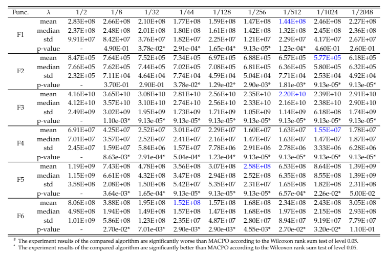

# Benchmark Functions for Network-based Distributed Optimization

## Introduction

We design 18 benchmark functions from the perspective of problem scale, homogeneity and heterogeneity, elementary function type, and network topology. 

All the functions in this benchmark are conflicting overlapping problems, that is, the shared variables have different optimum values with respect to different subcomponents. 
$$\boldsymbol{x} _ {i,opt}^d \neq \boldsymbol{x} _ {j,opt}^d, d\in \mathcal{I} _ {i,j}$$
The conflicting overlapping problem is more realistic than the conforming overlapping problem where shared variables have the same optimum value with respect to different subcomponents. In these conflicting overlapping problems, the optimal fitness of each subproblem is zero, but the optimal fitness of the global problem is larger than zero. That's because subproblems cannot reach the optimal solution at the same time because the conflict between original local objectives. Therefore, the fitness of solutions in the later experiments seems to be a large number.

## Setting of Benchmark Functions

The above table shows the problem scale, homogeneity and heterogeneity, elementary function type, and network topology of benchmark functions. 

Functions F1-F6 contain 20 subcomponents, including five 100-dimensional problems, five 50-dimensional problems, and ten 25-dimensional problems. These subcomponents overlap with each other in a chain structure, the same topology as “f13” and “f14” in benchmark CEC2013. Each subcomponent has two neighbors except for the first and last one, and the size of each overlap domain is 5 dimensions. Thus, the size of the global problem is $100 * 5+50 * 5+25 * 10-19 * 5=905$ dimensions.

Functions F7-F12 contain 40 100-dimensional subcomponents. Each subcomponent has 3 neighbors. A randomly generated network is used as the topology of functions, where the size of each overlap domain is 10 dimensions. Thus, the size of the global problem is $100 * 40-60 * 10 =3400$ dimensions.

Functions F13-F18 contain 60 200-dimensional subcomponents. Each subcomponent has 4 neighbors. A randomly generated network is used as the topology of functions, where the size of each overlap domain is 15 dimensions. Thus, the size of the global problem is $200 * 60-120 * 15 =10200$ dimensions.

The type of elementary functions includes Elliptic, Schwefel and Rosenbrock. Functions F1-F3, F7-F9, F13-F15 are homogeneous functions, and Functions F4-F6, F10-F12, F16-F18 are heterogeneous functions. 

The definition of local objective functions are described in Table S1 in the supplementary material. To be specific, $|S _ i|$ is the problem scale of $i$th subcomponent, $\boldsymbol{x} _ i^{opt}$ is the optimum solution of subproblem $f _ i$, $T _ {osz}$ is a transformation function to create smooth local irregularities, $T _ {asy}^{0.2}$ is a transformation function to break the symmetry of functions. Thus, all the local objective functions are non-separable functions. 

In the benchmark of \DDOPs, the global objective function $F$ is a sum of local objective functions.
$$F = \sum _ {i=1}^{n} f _ i$$
The local objective functions are realized based on three elementary functions: Elliptic, Schwefel, and Rosenbrock.
$$f _ {elliptic}(x)=\sum _ {i=1}^D 10^{6\frac{i-1}{D-1}}x _ i^2$$
$$f _ {schwefel}(x)=\sum _ {i=1}^D (\sum _ {j=1}^i x _ i)^2$$
$$f _ {rosenbrock}(x) = \sum _ {i=1}^{D-1} 100(x _ i^2-x _ {i+1})^2+(x _ i-1)^2$$

It is worth noting that the local objective functions are processed in four steps:

1. The optimal solution of functions is shift from $\vec{0}$ to $\boldsymbol{x} _ i^{opt}$, which is randomly generated. This operation ensures that the optimal solution of each local objective function is different. 
2. The vector is rotated by an orthogonal matrix $R$, which is also randomly generated. The operation makes all the variables in the objective function interdependent on each other, ensuring the local objective function is non-separable.
3. The vector is put into a transformation function $T _ {osz}$ to create smooth local irregularities. 
4. The vector is put into a transformation function $T _ {asy}$ to break the symmetry of the symmetric functions.

Finally, the local objective function is expressed as follows:
$$f _ i=f _ {elementary}(z _ i)$$
$$z _ i=T _ {asy}^{0.2}(T _ {osz}(R _ iy _ i))$$
$$y _ i=\boldsymbol{x} _ i-\boldsymbol{x} _ i^{opt}$$

The definition of $T _ {osz}$ and $T _ {asy}$ can be found in benchmark CEC2013 [1].

[1] X.  Li,  K.  Tang,  M.  N.  Omidvar,  Z.  Yang,  and  K.  Qin,  “Benchmark  Functions  for  the  CEC’2013  Special  Session  and  Competition  onLarge-Scale Global Optimization,”gene, p. 23, 2013.

## Parameter Setting of MACPO

The setting of penalty weight is important to balance the relative size of the penalty item and the original objective value. When the penalty weight is set to a large value, the fitness is mainly determined by the distance between the evaluated solution and the consensus solution. In this case, the whole population will evolve closely around the consensus solution and the exploration of the algorithm is poor. When the penalty weight is set to a small value, the fitness is mainly determined by the local fitness of the evaluated solution. In this case, the population will evolve towards the original local objective and ignore the cooperation with neighbors. This is not what we expect. In conclusion, medium weight is preferred in MACPO. 

The above figure shows the performance of MACPO on F1-F6 when the parameter $\lambda$ is set to different values. In the figures, the x-coordinate represents the value of $\lambda$, and the y-coordinate represents the average fitness of MACPO after 25 repeated experiments. The parameter $\lambda$ determines the penalty weight $w = \lambda \sum _ {i=1}^n f _ i(\boldsymbol{x} _ {i,con})$. According to the result, both too large and too small value of $\lambda$ does not benefit the performance of MACPO. Therefore, we select 1/512 as the value of $\lambda$ for MACPO finally.

